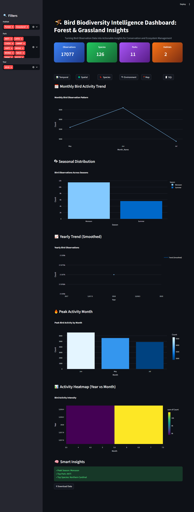
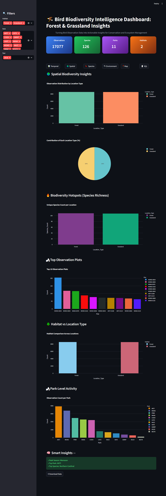
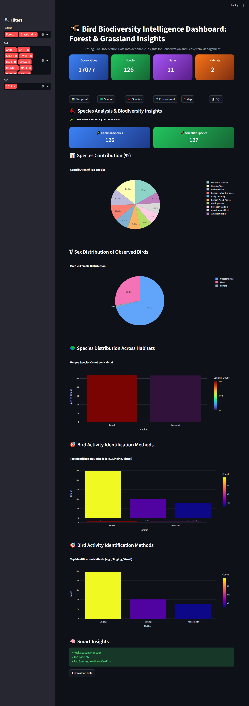
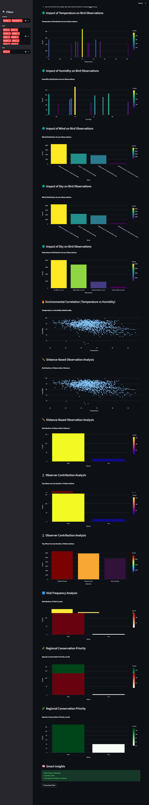
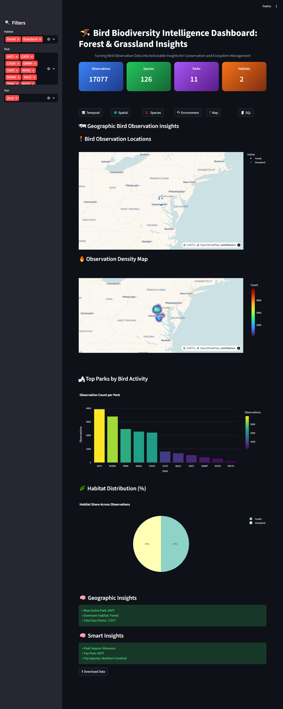
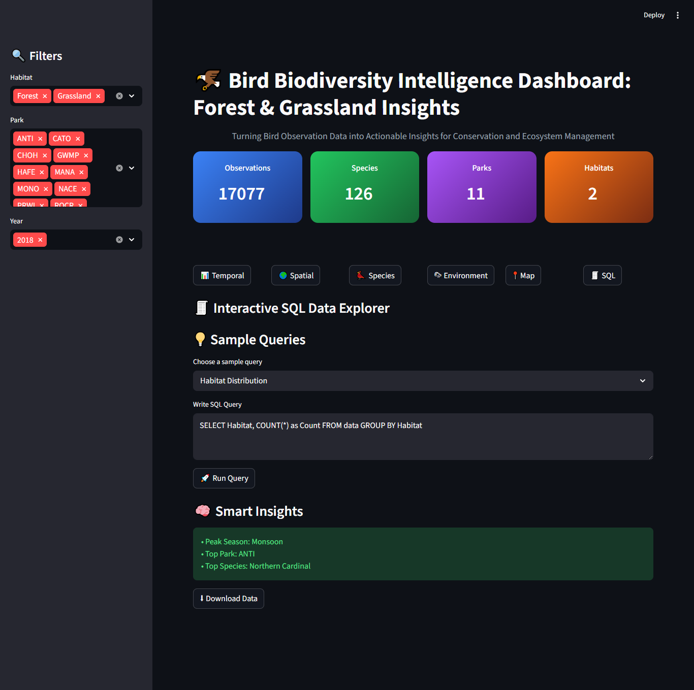

# 🐦 Bird Biodiversity Intelligence Dashboard

🚀 An interactive biodiversity analytics dashboard designed to transform bird observation data into actionable ecological insights using **Python, Streamlit, Plotly, and SQL**.

---

# 🌍 Project Overview

The **Bird Biodiversity Intelligence Dashboard** analyzes bird observation datasets collected from **forest and grassland ecosystems**.

The dashboard provides powerful insights into:

- 🌦 Seasonal bird activity trends
- 🌍 Spatial biodiversity hotspots
- 🐦 Species distribution & diversity
- 🌡 Environmental impact on observations
- 🗺 Geographic visualization of parks
- 🧾 Interactive SQL-based data exploration

This project demonstrates how **data analytics and visualization** can support ecological monitoring and conservation planning.

---

# ✨ Key Features

✅ Interactive Streamlit Dashboard  
✅ Advanced Plotly Visualizations  
✅ Temporal & Spatial Analysis  
✅ Biodiversity Hotspot Detection  
✅ KPI Cards & Dynamic Metrics  
✅ SQL Query Explorer  
✅ Geospatial Mapping  
✅ Professional UI Design  

---

# 📊 Dashboard Preview

## 🌍 Main Dashboard



---

# 🌦 Temporal Analysis


### Features

- Seasonal Trends
- Monthly Bird Activity
- Year vs Month Heatmap
- Observation Timeline Analysis

---

# 🌍 Spatial Analysis



### Features

- Biodiversity Hotspots
- Park-Level Activity
- Habitat Comparison
- Geographic Distribution

---

# 🐦 Species Analysis



### Features

- Top Species Distribution
- Species Diversity Metrics
- Habitat-wise Species Analysis
- Species Contribution Analysis

---

# 🌡 Environmental Insights



### Features

- Temperature Impact
- Humidity & Wind Analysis
- Environmental Correlation
- Weather-Based Observation Analysis

---

# 🗺 Map Visualization



### Features

- Geographic Distribution
- Observation Density Map
- Spatial Clustering
- Park-Level Mapping

---

# 🧾 SQL Explorer



### Features

- Interactive SQL Queries
- Dynamic Data Exploration
- Query Result Visualization
- Smart Insights Generation

---

# 📸 Additional Dashboard Visuals

## 🔥 Activity Heatmap


---

## 📍 Bird Observation Locations


---

## 🌡 Environmental Correlation


---

## 🌿 Habitat vs Location Type


---

## 🌡 Temperature Impact Analysis


---

## 📈 Monthly Bird Activity Trend


---

## 🏞 Park-Level Activity


---

## 🌍 Spatial Biodiversity Insights


---

## 🐦 Species Contribution


---

## 🌿 Species Distribution Across Habitats


---

## 🥇 Top 10 Most Observed Bird Species


---

## 🏆 Top Parks by Bird Activity


---

# 🛠 Tools & Technologies

| Technology | Purpose |
|------------|---------|
| Python | Data Analysis |
| Pandas | Data Processing |
| Plotly | Interactive Charts |
| Streamlit | Dashboard UI |
| SQLite | SQL Query Engine |
| Excel | Dataset Source |

---

# 📂 Dataset Information

The project uses two ecological datasets:

- 🌲 Forest Bird Monitoring Dataset
- 🌾 Grassland Bird Monitoring Dataset

---

## 🔑 Key Columns

- Common_Name
- Scientific_Name
- Habitat
- Park
- Season
- Temperature
- Humidity
- Wind
- Sky
- Observer
- Distance

---

# 📈 Dashboard Modules

| Module | Description |
|--------|-------------|
| Temporal Analysis | Seasonal & yearly trends |
| Spatial Analysis | Location-based insights |
| Species Analysis | Species diversity |
| Environment | Weather impact analysis |
| Map Visualization | Geographic distribution |
| SQL Explorer | Interactive SQL queries |

---

# 🧠 Key Insights

- 🌧 Bird activity peaks during the **Monsoon season**
- 🌲 Forest habitats show **higher biodiversity**
- 📍 Certain parks act as **biodiversity hotspots**
- 🌡 Environmental conditions strongly influence observations
- 🐦 A few dominant species contribute most observations

---

# 📊 Advanced Analytical Insights

| Insight Area | Observation |
|--------------|-------------|
| Seasonal Trends | Peak activity observed during Monsoon |
| Habitat Diversity | Forest habitats contain higher species richness |
| Spatial Analysis | ANTI park shows maximum observation density |
| Species Analysis | Northern Cardinal dominates observations |
| Environmental Impact | Moderate climate conditions increase sightings |

---

# 🖥 Installation & Setup

## 1️⃣ Clone the Repository

```bash
git clone https://github.com/your-username/bird-biodiversity-dashboard.git
```

---

## 2️⃣ Navigate to Project Folder

```bash
cd bird-biodiversity-dashboard
```

---

## 3️⃣ Install Required Libraries

```bash
pip install -r requirements.txt
```

---

## 4️⃣ Run the Streamlit App

```bash
streamlit run app.py
```

---

# 📂 Project Structure

```bash
Bird_Biodiversity_Dashboard/
│
├── app.py
├── requirements.txt
├── README.md
├── datasets/
│   ├── forest_data.xlsx
│   └── grassland_data.xlsx
│
├── Preview/
│   ├── temporal-analysis.png
│   ├── spatial-analysis.png
│   ├── species-analysis.png
│   ├── environment-analysis.png
│   ├── map-visualization.png
│   ├── sql-explorer.png
│   ├── activity-heatmap.png
│   ├── bird-observation-locations.png
│   ├── environmental-correlation.png
│   ├── habitat-vs-location.png
│   ├── temperature-impact.png
│   ├── monthly-bird-activity.png
│   ├── park-level-activity.png
│   ├── spatial-biodiversity-insights.png
│   ├── species-contribution.png
│   ├── species-habitat-distribution.png
│   ├── top-species.png
│   └── top-parks.png
│
└── report/
    └── project_report.pdf
```

---

# 📊 SQL Feature Example

```sql
SELECT Habitat, COUNT(*) 
FROM data
GROUP BY Habitat;
```

---

# 🌍 Business / Ecological Impact

This dashboard helps:

- Biodiversity monitoring
- Habitat conservation planning
- Ecological research
- Environmental decision-making
- Wildlife activity analysis

---

# 🚀 Future Improvements

- Real-time bird tracking integration
- AI/ML prediction models
- Mobile-responsive dashboard
- Additional ecosystem coverage
- Conservation risk analysis
- Advanced ecological forecasting

---

# 👨‍💻 Author

## Ayush Dash

📊 Data Analytics Enthusiast  
🌍 Environmental Data Visualization Project  

---

# 📜 License

This project is for educational and analytical purposes.

---

# ⭐ Final Note

This project showcases skills in:

- Data Cleaning
- Exploratory Data Analysis
- Dashboard Development
- Interactive Visualization
- SQL Integration
- Ecological Analytics
- Geospatial Visualization
- Environmental Intelligence

If you like this project, ⭐ star the repository!